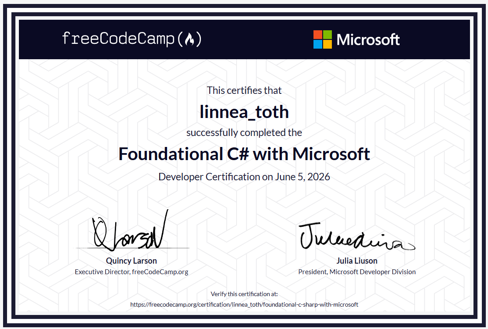

# Practice code

This repo is home to a pile of raw practice files from the process when I did the course [Foundational C# with Microsoft](https://devblogs.microsoft.com/dotnet/announcing-foundational-csharp-certification/) at [freeCodeCamp](https://www.freecodecamp.org/learn/foundational-c-sharp-with-microsoft/)!^

Some of it is written from scratch, some is based on starter code as instructed in the excercises. Cheers.

